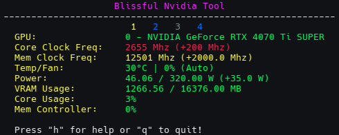

<div align="center">
  <h1>Blissful Nvidia Tool</h1>
  
</div>

This is just a simple tool for monitoring, controlling, and over or underclocking your modern (Maxwell or higher should be supported) Nvidia GPU from the command line. It was written for Linux but might work on Windows too. It only requires Python3 and nvidia-ml-py(Note pynvml is renamed to this now see: https://pypi.org/project/nvidia-ml-py/) and Nvidia Driver 555.xx or greater for overclocking functions. You accept ALL responsibility for the use of this tool. Monitoring can be done as any user but overclocking control requires root/admin. License is MIT.

## Usage

```
python blissnvidiatool.py  # Run a monitor for the GPU
python blissnvidiatool.py --reactive-color  # Run a colorful monitor for the GPU
# Any of the below need root/admin permissions!
python blissnvidiatool.py --set-clocks -150 1000  # Set the GPU core offset to -150Mhz and GPU memory offset to +1000Mhz. 
# Note the memory value is the same as that specified in GreenWithEnvy/MSI Afterburner, NOT the same as nvidia-settings!
python blissnvidiatool.py --set-power-limit 300  # Set the power limit in watts. nvidia-ml-py will reject invalid values. 
python blissnvidiatool.py --set-max-fan  # Set ALL fans to maximum speed.
python blissnvidiatool.py --set-auto-fan  # Set ALL fans back to automatic control.
# Additionally you can specify which GPU to monitor or control with --gpu-number:
python blissnvidiatool.py --gpu-number 1 --set-power-limit 280  # Set the power limit to 280 Watts on GPU 1 (0 is 1st, 1 is 2nd, etc...)
```
